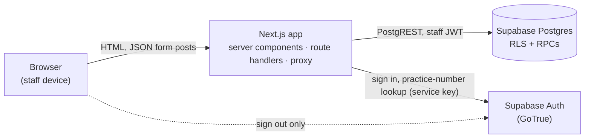
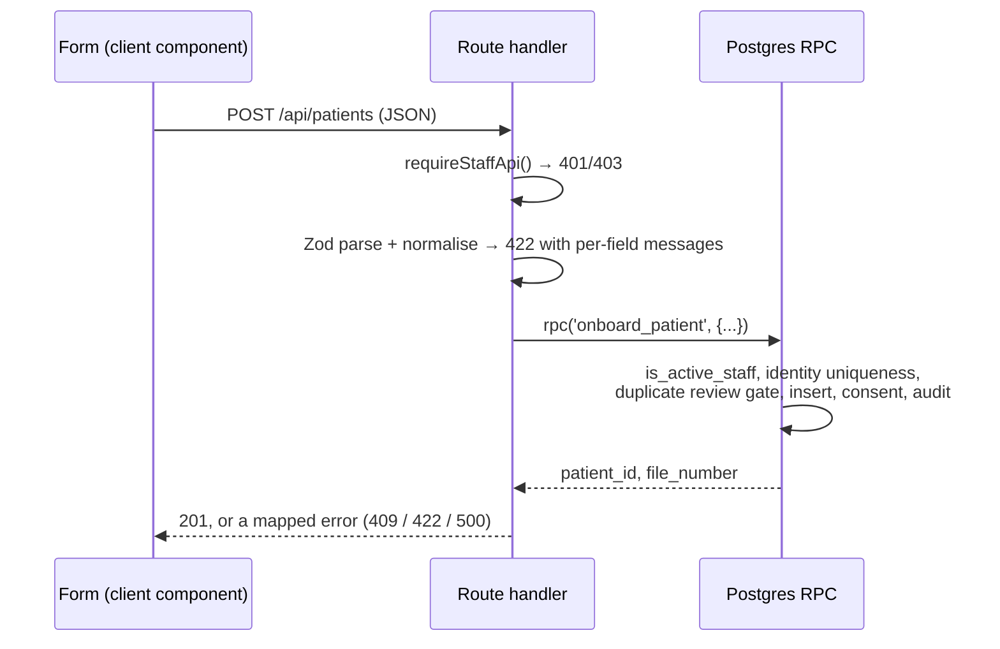
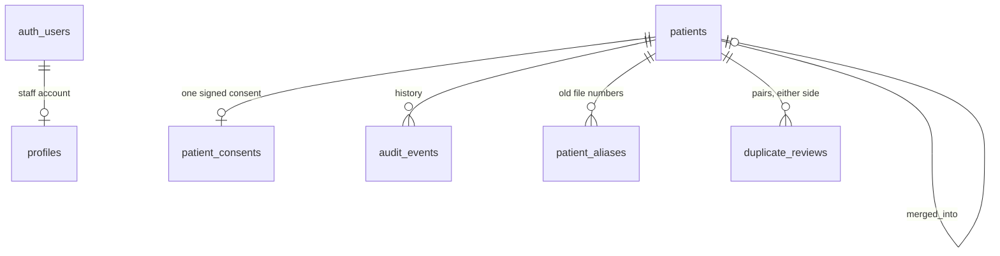

# System architecture

How DRRG Patient Onboarding is put together, and why. For what the product does
see [README](../README.md); for how to get it running see
[DEPLOY](../DEPLOY.md) and README → Local setup.

## 1. What shapes the design

An internal register for the practice's cash patients. Four constraints decide
almost every structural choice here:

| Constraint | Consequence |
| --- | --- |
| Staff-only, no patient-facing surface | One trust level (doctor / reception), no public API, no anonymous role |
| HPCSA record retention | Nothing is ever hard deleted. Removal is `status = 'archived'`, and merges archive the losing record |
| POPIA | Identity numbers are only ever returned masked; audit history is doctor-only; the practice-number → email mapping never reaches the browser |
| One paper file can hold a household | `file_number` is not unique, and people sharing one are excluded from each other's duplicate checks |

There is no clinical, billing or medical-aid data in this system, by design.

## 2. Stack

| Layer | Choice |
| --- | --- |
| Web | Next.js 16 (App Router, React 19, server components by default) |
| Language | TypeScript 6, strict |
| Validation | Zod 4 (`src/lib/patients/schema.ts`) |
| Database | Supabase Postgres — schema, constraints, RPCs, RLS |
| Data access | PostgREST via `@supabase/supabase-js` + `@supabase/ssr` (cookie sessions) |
| Auth | Supabase Auth (GoTrue), email/password |
| Tests | Vitest (unit) + a SQL runner over real migrations (`scripts/db-test`) |

No ORM, no separate API service, no client-side data store. Node ≥ 20.9.

## 3. Runtime topology

The Next.js server is the only thing that reads or writes patient data. The
browser holds a Supabase session cookie but never queries patient tables with
it — the one exception is `signOut()` in `sign-out-button.tsx`.

## 4. Request paths

**Reads** — server components call the database directly and render HTML:

- `patients/page.tsx` → `search_patients()` (one RPC returns the page, the total
  and each row's duplicate tier)
- `patients/[id]/page.tsx` → `.from("patients").select(...)` plus household
  members, flagged pairs and (for doctors) `audit_events`
- `patients/duplicates/page.tsx` → `list_duplicate_reviews()`

**Writes** — a client component posts JSON to a route handler under
`src/app/api/`, which validates it and calls one RPC:

Every mutation follows this shape:

| Route | RPC | Notes |
| --- | --- | --- |
| `POST /api/patients` | `onboard_patient` | Also re-checks the consent version/hash against `src/lib/consent.ts` |
| `PATCH /api/patients/[id]` | `update_patient` | |
| `POST /api/patients/[id]/archive` | `archive_patient` | Reason required |
| `POST /api/patients/[id]/restore` | `restore_patient` | Doctors only, and never for a merged record |
| `POST /api/patients/duplicates` | `find_possible_duplicates` | Read-only; also does the hard identity check |
| `POST /api/patients/duplicates/resolve` | `resolve_duplicate` | "Keep both" |
| `POST /api/patients/duplicates/merge` | `merge_patients` | |
| `POST /api/auth/login` | — | Signs in; resolves a practice number to an email server-side |

`src/lib/api/errors.ts` maps Postgres error codes to stable HTTP responses and
logs every failure with its code — including `PGRST202`/`PGRST204`, which mean
"the database is missing a migration this build needs" rather than a bug.

The whole callable surface, and nothing else, is:

| `public` function | Mode | Called from |
| --- | --- | --- |
| `onboard_patient` | definer | `POST /api/patients` |
| `update_patient` | definer | `PATCH /api/patients/[id]` |
| `archive_patient` | definer | archive route |
| `restore_patient` | definer | restore route (doctor) |
| `merge_patients` | definer | merge route |
| `resolve_duplicate` | definer | resolve route |
| `find_possible_duplicates` | invoker | duplicates route, and `onboard_patient` |
| `list_duplicate_reviews` | invoker | Possible duplicates page |
| `search_patients` | invoker | Patients page |
| `next_patient_file_number` | invoker | default for `patients.file_number` |
| `no_identity_reason_label` | invoker | writes the legacy free-text mirror |

`private` holds the helpers those functions are built from — `is_active_staff`,
`is_active_doctor`, `normalise_name`, `normalise_phone`, `normalise_address`,
`postal_code_from_address`, `address_without_postal_code`, `address_match_key`,
`duplicate_match`, `patient_match_fingerprint`, `pair_match_fingerprint` — and
is not reachable through the API.

## 5. Four gates, in order

Defence in depth: each gate assumes the ones before it may be bypassed.

1. **`src/proxy.ts`** (Next 16 proxy, formerly middleware) — refreshes the
   Supabase session cookie and redirects unauthenticated requests for HTML
   routes to `/login`. API routes are excluded; they answer for themselves.
2. **`requireStaffPage()` / `requireStaffApi()`** — loads `profiles` for the
   signed-in user and demands `active` with role `doctor` or `staff`. Pages
   redirect, API routes return 401/403.
3. **RLS + grants** — RLS is on for every public table, and `authenticated` is
   granted **SELECT only** on all of them. `anon` has nothing. The policies:
   `private.is_active_staff()` for `patients`, `patient_consents`,
   `duplicate_reviews` and `patient_aliases`; `is_active_doctor()` for
   `audit_events` and `patient_deletions`; `profiles` allows a user their own
   row plus the active-staff directory (needed to name the actor in an audit
   trail).
4. **`security definer` RPCs** — the only way patient data changes.

> **The invariant that holds the model together:** no role reachable from the
> browser can `INSERT`, `UPDATE` or `DELETE` a patient row. Writes exist only
> inside `onboard_patient`, `update_patient`, `archive_patient`,
> `restore_patient`, `merge_patients` and `resolve_duplicate`, each of which
> re-checks staff access, enforces its rules and writes its own audit event.
> `scripts/verify-local-db.mjs` asserts a direct insert is refused with `42501`.

Every function in both schemas is `set search_path = ''` and fully qualifies its
references. `private` is not exposed to PostgREST.

## 6. Where the rules live

**Postgres is authoritative.** The database is the last thing standing between a
mistake and the register, so every rule that matters is a constraint or a check
inside an RPC. TypeScript exists to tell staff what is wrong *before* they
submit, and to render it.

Three modules deliberately mirror SQL. They are contracts, not implementations —
if one drifts, the database wins and the UI is wrong:

| TypeScript | Mirrors | Purpose |
| --- | --- | --- |
| `lib/patients/duplicate-score.ts` | `private.duplicate_match` | Weights, tiers, banner copy, fingerprint |
| `lib/patients/address.ts` | `private.postal_code_from_address`, `address_without_postal_code`, `address_match_key` | Postal-code extraction and address matching |
| `lib/patients/schema.ts` | table constraints + RPC guards | Per-field form validation |

Each mirror has unit tests stating the shared contract; the SQL side is asserted
separately in `scripts/db-test/tests/`.

## 7. Data model

| Table | Holds | Notes |
| --- | --- | --- |
| `profiles` | Staff identity and role | The authorization table. An auth user without a profile row can sign in and do nothing |
| `patients` | The register | Soft-deleted only. `merged_into` points at the survivor |
| `patient_consents` | The consent captured at registration | **Unique per patient**; stays with the record it was signed for, even after a merge |
| `duplicate_reviews` | Flagged / resolved pairs | `flagged` → the queue; `not_duplicate` carries a fingerprint; `merged` is terminal |
| `patient_aliases` | File numbers that used to belong to a merged record | Only created when nobody else still holds the number |
| `audit_events` | Who did what, per patient | Doctor-readable. Every mutating RPC writes here; the allowed actions are a check constraint (`patient_created`, `patient_updated`, `patient_archived`, `patient_restored`, `patient_deleted`, `duplicate_reviewed`, `duplicate_resolved`, `patient_merged`) |
| `patient_deletions` | Log of deletions from before hard delete was removed | Historical; nothing writes to it any more |

Enums: `staff_role`, `patient_identity_type`, `patient_status`,
`signature_type`, `duplicate_review_status`, `no_identity_reason_code`.

Invariants worth knowing before changing anything:

- **`file_number` is not unique.** A household shares one. Reuse is only
  reachable through `onboard_patient(p_join_file => true)`; typing an existing
  number into the form is still a `23505`.
- **`patients_unique_identity_idx`** — unique on identity type + issuing country
  + normalised number, excluding `none`. This is the hard duplicate block.
- **`patients_contact_shape_check`** — phone and address are both required
  unless `no_contact_reason` explains their absence. Postal code is not part of
  this.
- **`patients_identity_shape_check`** — a coded reason is required when no
  document is on file; a note only for `other`.
- **`patients_archive_shape_check`** — `active` implies no `archived_at` and no
  `merged_into`.
- **`phone_normalized`** is a generated column (`private.normalise_phone`), so
  `082…` and `+27 82…` are one number everywhere, including in indexes.
- **`postal_code`** is optional, four digits, and never a matching signal.

## 8. Duplicate detection

Three entry points onto one scoring model (name 3, date of birth 3, email 2,
phone 1, address 1; *likely* = identity match, name + date of birth, or ≥ 6;
*possible* = ≥ 2 points across ≥ 2 fields):

| Function | Used for | Compares |
| --- | --- | --- |
| `find_possible_duplicates` | Registration, before a record exists | Submitted form values against active patients |
| `private.duplicate_match` | Two records that both exist | Stored rows; drives queue tiers and register badges |
| `list_duplicate_reviews` | The Possible duplicates page | Only pairs recorded in `duplicate_reviews` with `status = 'flagged'` and both files active |

**The queue is a record, not a scan.** A pair is written to `duplicate_reviews`
when someone registers or edits a patient and the matcher finds it. Nothing
sweeps the register afterwards, so a pair the matcher used to miss stays off the
page until either file is touched again — which is why a change to the matching
rules needs a deliberate post-deployment step for pairs already on file (see
`supabase/post-deploy/`).

Supporting decisions:

- Addresses are compared on `private.address_match_key`: content only, with
  case, accents, punctuation, line breaks, separators and any trailing postal
  code removed. `1410 Zone 13 Sebokeng 1983` and `1410 Zone13 Sebokeng` are one
  address.
- Postal code scores zero. A delivery area is shared by thousands of patients.
  It is displayed beside the address on a review because *which file has it* is
  often the explanation.
- Household members never flag each other (`p_file_number` exclusion).
- A "keep both" decision stores `resolved_fingerprint`, a hash of the matched
  fields. `update_patient` re-opens the pair only when that hash changes and the
  pair still matches — so a dismissal survives unrelated edits.
- Nothing merges automatically. Merging is always a staff action through the UI.

## 9. Authentication and roles

Supabase Auth issues the session; `profiles` decides what it is worth. Sign-in
accepts an email **or** a practice number — the number is resolved to an email
inside `POST /api/auth/login` using the service key, so the mapping is never
exposed to an unauthenticated client, and both failure paths return the same
generic message.

| Capability | staff | doctor |
| --- | --- | --- |
| Register, edit, archive patients | ✓ | ✓ |
| Review and resolve duplicates, merge | ✓ | ✓ |
| See a patient's activity history | — | ✓ |
| Include archived / archived-only in search | — | ✓ |
| Restore a manually archived file | — | ✓ |

Role checks live in the database (`private.is_active_doctor()` inside
`restore_patient`, `search_patients` and the RLS policies), not only in the UI.

## 10. Configuration

| Variable | Where | Purpose |
| --- | --- | --- |
| `NEXT_PUBLIC_SUPABASE_URL` | Browser + server | Project URL |
| `NEXT_PUBLIC_SUPABASE_PUBLISHABLE_KEY` | Browser + server | Publishable key. Safe to expose — it carries no privileges of its own; RLS and the grants decide what it can see |
| `SUPABASE_URL` / `SUPABASE_PUBLISHABLE_KEY` | Local scripts | Same values for the seed and verify scripts |
| `SUPABASE_SECRET_KEY` | **Server only** | Practice-number lookup in the login route; local seed/verify scripts. Bypasses RLS entirely |

The secret key must never appear in a `NEXT_PUBLIC_*` variable. Local
development runs the whole stack through `npx supabase start` against the same
migrations as production.

## 11. Changing the schema

Forward-only, one numbered file per change in `supabase/migrations/`
(`YYYYMMDDHHMMSS_name.sql`), applied in filename order with `supabase db push`.

- Migrations run **before** the app code that depends on them. The old app
  tolerates a new column; the new app does not tolerate a missing one.
- Functions are recreated in full rather than patched, so each file is a
  complete statement of the function it changes. A signature change means
  `drop` + `create` and re-granting.
- `supabase_migrations.schema_migrations` is the ledger; `npm run
  migrations:ledger` prints the one-time repair command for a database that was
  set up by hand. Drift between repo and database is otherwise invisible.
- A migration that changes the API surface (a column, an RPC signature) ends
  with `notify pgrst, 'reload schema'`. Without it PostgREST serves a stale
  cache and the app gets `PGRST202`/`PGRST204` until it refreshes on its own.
  The four most recent migrations do this; the earlier ones predate the habit.
- Data operations that need a real staff user for attribution live in
  `supabase/post-deploy/` as documented, re-runnable scripts rather than silent
  production edits.

## 12. Testing

| Layer | Command | Catches | Cannot catch |
| --- | --- | --- | --- |
| Unit + component | `npm test` | Validation rules, scoring contract, address rules, rendered markup | Anything the database actually enforces |
| Database | `npm run test:db` | Constraints, RPC behaviour, RLS-independent SQL logic, and what a migration's **backfill** did to rows seeded before it ran | Auth, PostgREST, the browser |
| Integration | `npm run verify:db`, `npm run verify:merge` | The real stack end to end: RLS, PostgREST, RPC errors, merge and re-flag flows | Migration-time data changes (it connects afterwards) |

`scripts/db-test/` applies every migration to a throwaway database. Supabase
platform objects the migrations depend on (`auth.users`, `auth.uid()`, the three
API roles, the `extensions` schema) are provided by `shim.sql`, which is never
deployed. `before/<migration>.sql` seeds rows immediately before a given
migration runs — the only moment a backfill's "before" state exists.

## 13. Deliberate non-goals

Not oversights:

- No clinical notes, billing or medical aid.
- No hard delete, anywhere, by anyone.
- No automatic merging of patients, at any score.
- No structured street/suburb/city/province fields; the address stays free text.
- No geocoding and no postal-code lookup service.
- No offline mode or client-side cache; every screen reads the database.
- No multi-tenancy — one practice, one project.

## 14. Known limits

Worth knowing before the register grows:

- `find_possible_duplicates` scans all active patients per check. The prefiltered
  version in migration `20260712000000` was superseded by the household rewrite;
  restore that shape if registration checking slows down.
- `search_patients` matches addresses with `private.normalise_address`, which
  does **not** strip the postal code — so searching an address together with its
  code no longer matches a record whose code has been split out. Postal-code
  search is not implemented.
- The duplicate queue depends on pairs being recorded (see §8); improving the
  matcher does not retroactively surface old pairs.
- `no_identity_reason` (free text) is still written alongside the coded reason
  until the practice has reviewed the backfill. Do not read it in new code.
